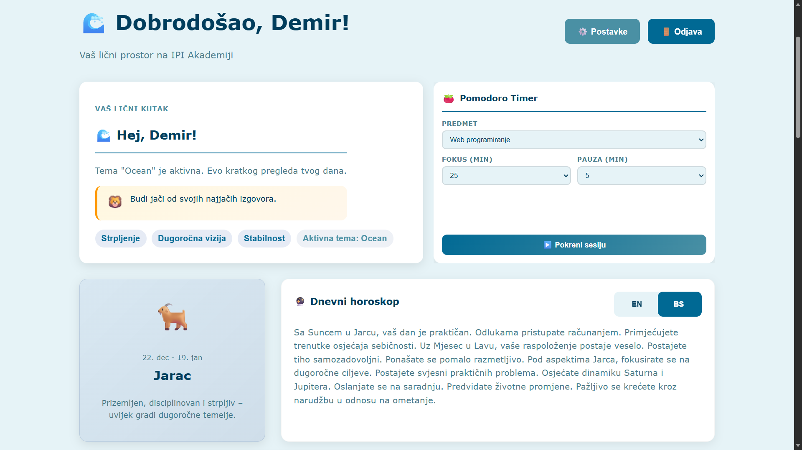
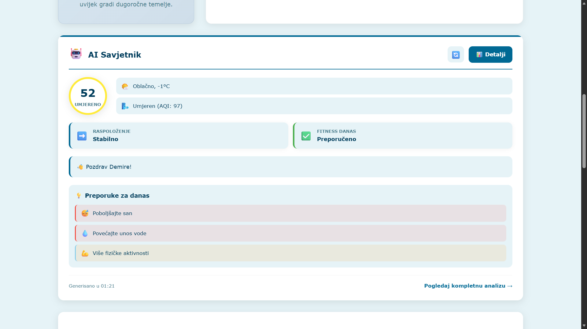
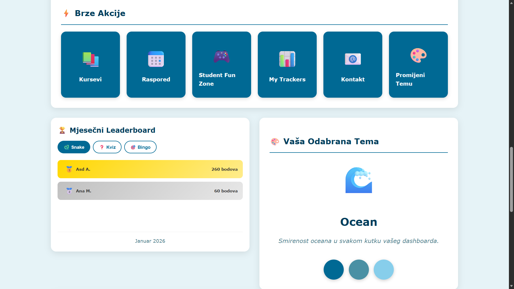
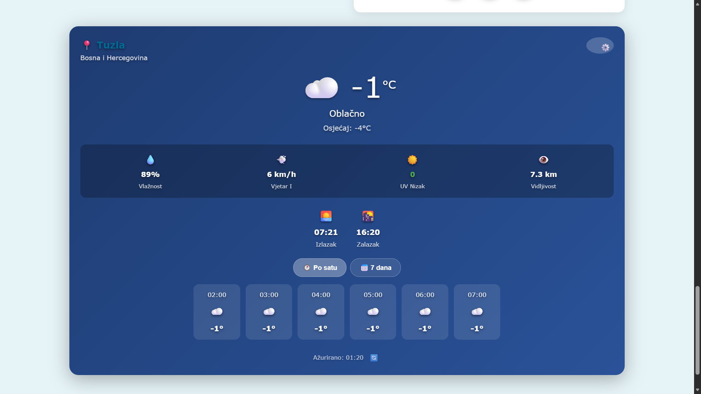
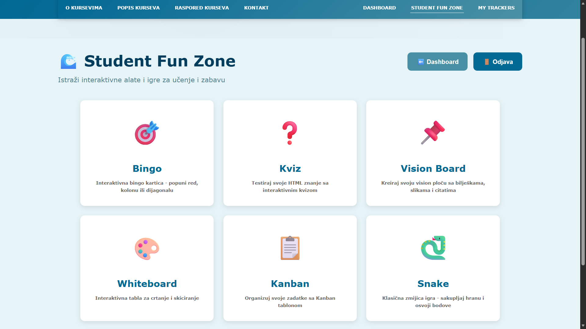
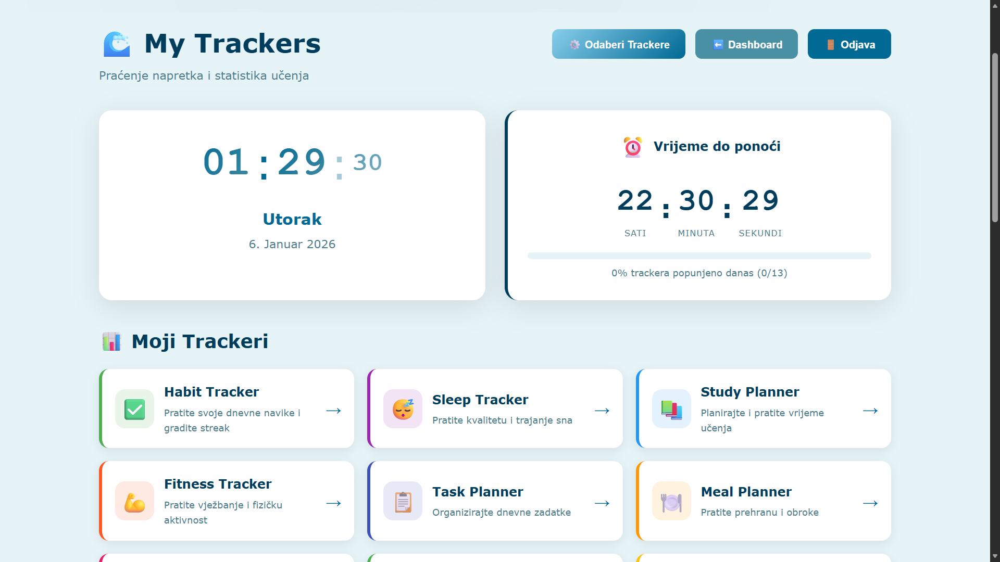
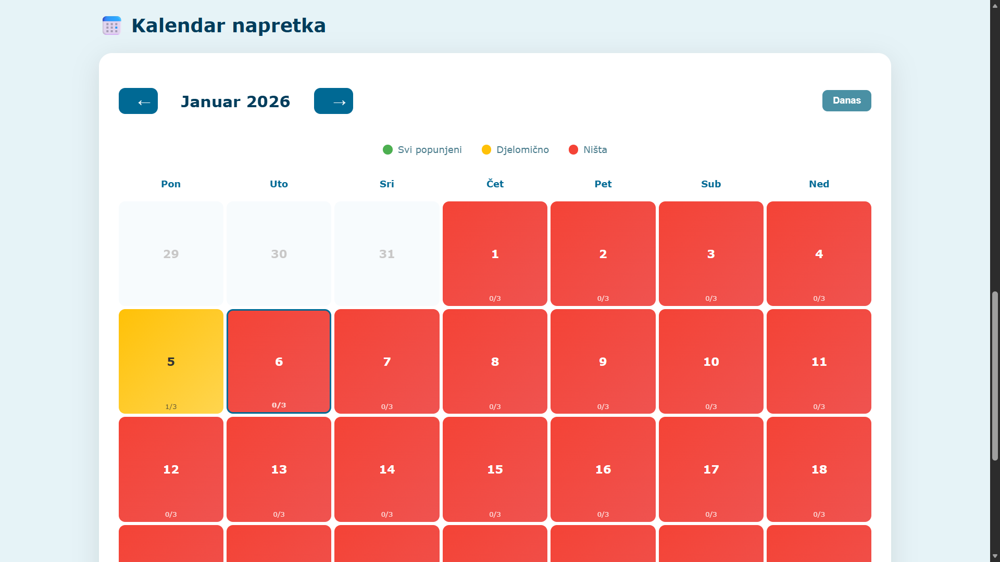
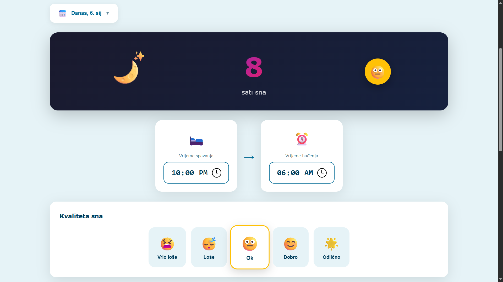
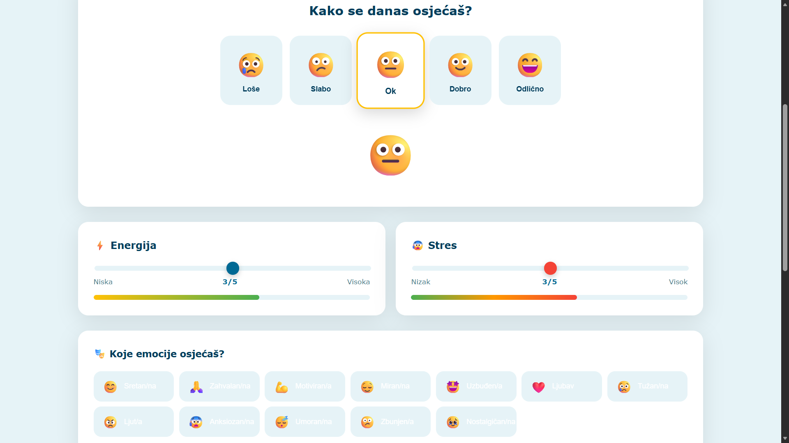

# Personal Life Dashboard (Angular)

Personal Life Dashboard is a modular single-page web application developed as part of the  
**Web Programming - Project 2** course at the **International Business-Information Academy Tuzla**.

The application enables students to track habits, productivity, health and daily activities through a customizable dashboard built with modern Angular architecture.

---

## 📌 Project Overview

This project demonstrates the transition from:

- static websites → dynamic SPA applications
- vanilla HTML/CSS/JavaScript → Angular framework
- simple pages → authenticated, data-driven dashboards

The focus is on modularity, scalability, user personalization and real-world web development practices.

---

## ✨ Features

- User authentication (Login / Register)
- Firebase-based data storage (per user)
- Modular personal dashboard
- Multiple life & productivity trackers
- Dynamic theme system (CSS variables)
- Rule-based AI-like productivity insights
- Student Fun Zone (games & tools)
- Data visualization with charts
- Pomodoro timer and productivity widgets
- Server-side rendering support (Angular SSR)

---

## 🛠 Tech Stack

- **Angular 21** (Standalone Components, SPA, SSR support)
- **TypeScript**
- **Firebase** (Authentication, Firestore)
- **Chart.js**
- **RxJS**
- **CSS3** (Theme variables)
- **LocalStorage**
- **Express.js** (SSR server)

---

## 🧱 Architecture Overview

- Component-Service architecture
- Standalone Angular components
- Centralized routing with AuthGuard
- Reactive state management
- Modular folder structure
- SSR-ready server configuration

---

## 🚀 Getting Started

### Install dependencies

```bash
npm install
```

### Run development server

```bash
npm start
```

Open:  
`http://localhost:4200`

---

## 📁 Project Structure (Simplified)

```
src/
 ├── app/
 │   ├── components/
 │   ├── pages/
 │   ├── services/
 │   ├── guards/
 │   ├── my-trackers/
 │   └── fun-zone/
 ├── assets/
 └── public/
```

---

## 📸 Project Showcase

Below is a visual overview of the key features and modules implemented in the **Personal Life Dashboard** application.  
All screenshots are taken from the real application and showcase fully implemented functionality.

---

### 🧩 Core Features Overview

<div align="center">

<table>
  <tr>
    <td align="center" width="33%">
      <br/>
      <strong>Dashboard</strong><br/>
      Centralized overview with widgets, stats and quick access
    </td>
    <td align="center" width="33%">
      <br/>
      <strong>AI Insight</strong><br/>
      AI recommendations based on user data
    </td>
    <td align="center" width="33%">
      <br/>
      <strong>Quick Actions</strong><br/>
      Fast access to common user actions
    </td>
  </tr>
  <tr>
    <td align="center" width="33%">
      <br/>
      <strong>Weather Widget</strong><br/>
      Real-time weather information with personalization
    </td>
    <td align="center" width="33%">
      <br/>
      <strong>Student Fun Zone</strong><br/>
      Games and productivity tools for students
    </td>
    <td align="center" width="33%">
      <br/>
      <strong>My Trackers</strong><br/>
      Access to all personal life tracking modules
    </td>
  </tr>
  <tr>
    <td align="center" width="33%">
      <br/>
      <strong>Calendar</strong><br/>
      Schedule and planning overview
    </td>
    <td align="center" width="33%">
      <br/>
      <strong>Sleep Tracker</strong><br/>
      Sleep duration, quality and trends visualization
    </td>
    <td align="center" width="33%">
      <br/>
      <strong>Mood Tracker</strong><br/>
      Mood, energy and stress level tracking
    </td>
  </tr>
</table>

</div>

---

### ℹ️ Notes

- All features shown above are **fully implemented using Angular standalone components**
- Data displayed is **user-specific** and stored via Firebase
- Charts and statistics are generated dynamically using Chart.js
- UI appearance adapts automatically based on the selected theme

---

## 🎓 Academic Context

**Course:** Web Programming  
**Project:** Project 2 - Personal Life Dashboard  
**Institution:** International Business-Information Academy Tuzla

---

## ✉️ Contact

[](https://www.linkedin.com/in/demir-halilbasic/) [](https://www.youtube.com/@DemkyDesignHub)

---

## 💬 Feedback

This project was developed for academic purposes.  
Suggestions, questions and feedback are welcome via GitHub issues or direct contact.
